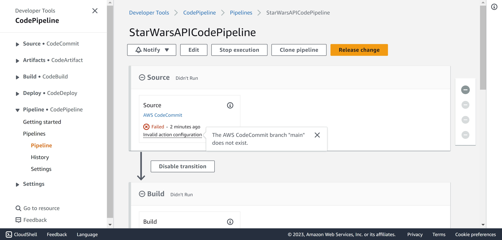

# CodePipeline de uma aplicação serverless
## Descrição do projeto
O objetivo desse projeto é construir uma *pipeline* para realizar o *deploy* automático de aplicações ***serverless***, utilizando módulos da **AWS** e **terraform**. Para ilustrar a utilização dessa *pipeline*, vamos utilizá-la para fazer a **integração e *deploy* contínuos** de uma **API de Star Wars**!

O diagrama a seguir demonstra o fluxo e as tecnologias da AWS utilizadas para criar a *pipeline*: 


A ideia de criar uma *pipeline* é facilitar a vida do desenvolvedor, limitando sua preocupação apenas em realizar mudanças no código e deixar com que infraestrutura realize a integração e *deploy* do novo código automaticamente.

No caso da *pipeline* proposta, o desenvolvedor deverá "*commitar*" o código da aplicação juntamente com dois arquivos: o **buildspec** e o **SAM template**, que serão utilizados posteriormente pela *pipeline*. O código será subido para um repositório **CodeCommit**, o serviço de hospedagem de repositório de controle de versão oferecido pela AWS. Sempre que o código for "*commitado*" para o repositório irá realizar um *trigger* no **CodePipeline**, iniciando o seu serviço. Esse estágio da *pipeline* é chamado de ***source***.  

A *pipeline* irá então partir para o estágio de ***build*** e, para isso, utilizará o **CodeBuild**: o serviço AWS que automatiza o processo de compilação, teste e criação de código-fonte em um ambiente de nuvem escalável. O CodeBuild utilizará o arquivo **buildspec** e o **Sam template** para gerar um template que será utilizado pelo próximo estágio da *pipeline*. Nesse estágio de *build*, seria possível também realizar qualquer tipo de teste no código da aplicação, como testes unitários e testes de vulnerabilidades. 

O último estágio da *pipeline* é o ***deploy*** que será feito pelo **CloudFormation**, o serviço da AWS que permite provisionar e gerenciar recursos de forma automatizada e programática na nuvem. Segundo a [documentação](https://docs.aws.amazon.com/codepipeline/latest/userguide/integrations-action-type.html#integrations-deploy-CloudFormation) do CodePipeline, utilizar a SAM (Serverless Application Model), uma extensão do CloudFormation que simplifica o desenvolvimento e a implantação de aplicativos serverless na plataforma AWS, é a maneira recomendada de fazer o *deploy* de aplicações *serverless*. Durante esse estágio existirão duas ações, uma para criar o ***change set*** do CloudFormation, utilizando o template que foi criado na etapa de *build*. Depois será realizado o *deploy* desse *change set*, dessa forma garantindo que a cada *commit* o serviço será alterado, porém não será recriado. 

Durante toda a pipeline serão utilizados outros recursos da AWS:
- **S3 Bucket**: Serão utilizados dois buckets, um para armazenar os artefatos gerados a cada estágio da *pipeline* e outro para guardar os logs do CodeBuild;
- **IAM**: Utilizado para gerenciar as permissões que cada serviço terá na *pipeline*;
- **CloudWatch**: Também utilizado para guardar os logs do CodeBuild; 
****

## Infraestrutura como código (IaC)
Nesse repositório está presente o código em **terraform** utilizado para descrever a infraestrutura da *pipeline*. O código está dividido em módulos, cada módulo representando um serviço AWS e os recursos necessários a ele dentro da *pipeline*, facilitando a organização do projeto. O arquivo `main.tf` interliga os módulos montando a pipeline. 

### Módulo CodeCommit
É o módulo mais simples onde será definido o repositório git que o desenvolvedor utilizará para subir o código da API. 

```tf
# Build CodeCommit git repo for our Star Wars API
resource "aws_codecommit_repository" "repo" {
  repository_name = var.repository_name
  description     = "CodeCommit repo for my Star Wars API"
  default_branch  = "main"
}

# Output the repo info back to main.tf
output "codecommit_repo_arn" {
  value = aws_codecommit_repository.repo.arn
}
output "codecommit_repo_name" {
  value = var.repository_name
}
```
### Módulo CodeBuild
Nesse módulo serão definidos os recursos necessários para o projeto CodeBuild da pipeline. 

O bucket utilizado para armazenar os logs gerados durante o *build* do projeto está definido a seguir:

```tf
# Build an AWS S3 bucket for codebuild logging
resource "aws_s3_bucket" "s3_logging_bucket" {
  bucket = var.s3_logging_bucket_name
}

# These rules are important in a CodePipeline to ensure the bucket is owned by the correct AWS account
resource "aws_s3_bucket_ownership_controls" "s3_logging_bucket" {
  bucket = aws_s3_bucket.s3_logging_bucket.id
  rule {
    object_ownership = "BucketOwnerPreferred"
  }
}

resource "aws_s3_bucket_acl" "s3_logging_bucket" {
  depends_on = [aws_s3_bucket_ownership_controls.s3_logging_bucket]

  bucket = aws_s3_bucket.s3_logging_bucket.id
  acl    = "private"
}
```

Ele contém regras ACL (Access Control List) especiais para limitar o acesso e execução dentro do bucket.

Além disso, esse módulo também define o recurso do projeto CodeBuild:

```terraform
# Create a CodeBuild Project for the API
resource "aws_codebuild_project" "codebuild_project" {
  name          = var.codebuild_project_name
  description   = "Star Wars API Codebuild project"
  build_timeout = "5"
  service_role  = var.codebuild_iam_role_arn

  artifacts {
    name                   = var.codebuild_project_name
    override_artifact_name = false
    packaging              = "NONE"
    type                   = "CODEPIPELINE"
  }

  cache {
    type     = "S3"
    location = aws_s3_bucket.s3_logging_bucket.bucket
  }

  environment {
    compute_type                = "BUILD_GENERAL1_SMALL"
    image                       = "aws/codebuild/amazonlinux2-x86_64-standard:4.0"
    image_pull_credentials_type = "CODEBUILD"
    type                        = "LINUX_CONTAINER"

    environment_variable {
      name  = "ARTIFACT_BUCKET_NAME"
      value = var.codepipeline_artifact_bucket_name
    }
  }

  logs_config {
    cloudwatch_logs {
      group_name  = "log-group"
      stream_name = "log-stream"
    }

    s3_logs {
      status   = "ENABLED"
      location = "${aws_s3_bucket.s3_logging_bucket.id}/${var.codebuild_project_name}/build-log"
    }
  }

  source {
    type = "CODEPIPELINE"
  }

  tags = {
    Terraform = "true"
  }
}
```
Muitas coisas estão sendo definidos nesse módulo, como para onde os logs serão mandados, qual o tipo de recurso computacional que o ambiente do projeto de CodeBuild precisa, o *source* e *artifacts* do projeto, ou seja, de onde o código vem e para onde vai. Um detalhe interessante é a variável de ambiente `ARTIFACT_BUCKET_NAME`, que será passada para o **buildspec**, facilitando a reutilização do módulo para diferentes *pipelines*. 

É nessa etapa em que o projeto roda o arquivo **buildspec.yml**:

```yml
version: 0.2
env:
    shell: bash

phases:
    build:
        commands:
            - echo deploy started on `date`
            - aws cloudformation package --template-file template.yml --s3-bucket $ARTIFACT_BUCKET_NAME --output-template-file outputtemplate.yml --debug

artifacts:
    files:
        - template.yml
        - outputtemplate.yml
```
Ele roda o comando `aws cloudformation package` para construir um **outputtemplate.yml** com base no **template.yml** que define o **CloudFormation stack**, com os recursos da API.

### Módulo CodePipeline
Esse é o módulo que lida com os recursos da *pipeline* e como orquestrá-los. 

Primeiramente, é definido o segundo S3 Bucket, utilizado para armazenar os artefatos da *pipeline*:

```tf
# Build an AWS S3 bucket for CodePipeline to use as artifact storage
resource "aws_s3_bucket" "codepipeline_artifact_bucket" {
  bucket = var.codepipeline_artifact_bucket_name
}

# These rules are important to use in a CodePipeline to ensure the bucket is only modified by our pipeline/account
resource "aws_s3_bucket_ownership_controls" "codepipeline_artifact_bucket" {
  bucket = aws_s3_bucket.codepipeline_artifact_bucket.id
  rule {
    object_ownership = "BucketOwnerPreferred"
  }
}

resource "aws_s3_bucket_acl" "codepipeline_artifact_bucket" {
  depends_on = [aws_s3_bucket_ownership_controls.codepipeline_artifact_bucket]

  bucket = aws_s3_bucket.codepipeline_artifact_bucket.id
  acl    = "private"
}
```

Posteriormente, é definido um recurso enorme que contém o CodePipeline. À princípio são definidos recursos para qualquer *pipeline*, como nome, IAM role e onde serão armazenados os artefatos:

```tf
# Create a CodePipeline for the API
resource "aws_codepipeline" "codepipeline" {
  name     = var.codepipeline_name
  role_arn = var.codepipeline_role_arn

  # Define the S3 bucket created as artifact bucket. 
  # This is used to pass the artifacts built by Build stage into deploy stage.
  artifact_store {
    location = aws_s3_bucket.codepipeline_artifact_bucket.bucket
    type     = "S3"
  }

  ...
```

O primeiro estágio da *pipeline* é o source, que utiliza o repositório CodeCommit criado no módulo anterior. 

```tf
...
# Retrieves the application code from the CodeCommit Repo
  stage {
    name = "Source"

    action {
      name             = "Source"
      category         = "Source"
      owner            = "AWS"
      provider         = "CodeCommit"
      version          = "1"
      output_artifacts = ["SourceArtifact"]

      configuration = {
        RepositoryName = var.codecommit_repo_name
        BranchName     = "main"
      }
    }
  }
...
```
O segundo estágio é o do *build*, onde será utilizado o projeto CodeBuild criado anteriormente. O `input_artifacts` desse estágio é o `output_artifacts` do estágio de source, é dessa maneira que uma etapa da *pipeline* é conectada com a próxima.

```tf
...
# Build the application using buildspec.yml and template.yml
  stage {
    name = "Build"

    action {
      name             = "Build"
      category         = "Build"
      owner            = "AWS"
      provider         = "CodeBuild"
      input_artifacts  = ["SourceArtifact"]
      output_artifacts = ["build_output"]
      version          = "1"

      configuration = {
        ProjectName = var.codebuild_project_name
      }
    }
  }
...
```

Entre os estágios de *build* e *deploy*, adicionei um novo estágio de *manual approval*, onde algum usuário deve fazer a revisão do que foi gerado nas etapas anteriores antes do *deploy* ser realizado. É uma etapa opcional, mas para *pipelines* onde não existe muita confiança nos testes que são feitos, é interessante acrescentar. 

```tf
# Manual approval before deploy stage
  stage {
    name = "Manual_Approval"

    action {
      name     = "Manual-Approval"
      category = "Approval"
      owner    = "AWS"
      provider = "Manual"
      version  = "1"
    }
  }
```

Por fim, o estágio de *deploy*, que utiliza o CloudFormation. Diferente das outras etapas não existe um módulo CloudFormation no projeto, a única informação necessária para o serviço funcionar é o ***template***, onde os recursos de *deploy* estão disponíveis: 

```yml
AWSTemplateFormatVersion: "2010-09-09"
Description: Simple Star Wars REST API deployed from CodePipeline using Cloudformation
Transform: AWS::Serverless-2016-10-31

Parameters:
  AccountId:
    Type: String

Resources:
  RetrieveCharactersLambda:
    Type: AWS::Serverless::Function
    Properties:
      FunctionName: retrieve-star-wars-characters
      Runtime: python3.9
      CodeUri: ./LambdaCode
      Handler: lambda_function.retrieve_handler
      Description: Description
      MemorySize: 512
      Timeout: 30
      Role: !Join
        - ''
        - - 'arn:aws:iam::'
          - !Ref AccountId
          - ':role/CodePipelineIamRole'

  RestAPI:
    Type: AWS::ApiGateway::RestApi
    Properties:
      Description: Simple Star Wars API
      Name: simple-star-wars-api

  RestAPIDeployment:
    Type: AWS::ApiGateway::Deployment
    DependsOn: RetrieveCharactersMethod
    Properties:
      RestApiId: !Ref RestAPI
      StageName: v1

  CharactersResource:
    Type: AWS::ApiGateway::Resource
    Properties:
      ParentId: !GetAtt RestAPI.RootResourceId
      PathPart: characters
      RestApiId: !Ref RestAPI

  RetrieveCharactersMethod:
    Type: AWS::ApiGateway::Method
    DependsOn:
      - RetrieveCharactersLambda
      - CharactersResource
    Properties:
      AuthorizationType: AWS_IAM
      HttpMethod: GET
      Integration:
        IntegrationHttpMethod: POST
        Type: AWS_PROXY
        Uri: !Sub arn:aws:apigateway:${AWS::Region}:lambda:path/2015-03-31/functions/arn:aws:lambda:${AWS::Region}:${AWS::AccountId}:function:retrieve-star-wars-characters/invocations
      ResourceId: !Ref CharactersResource
      RestApiId: !Ref RestAPI

  ApiGatewayInvokePermissionForRetrieveCharacters:
    Type: AWS::Lambda::Permission
    Properties:
      Action: lambda:InvokeFunction
      FunctionName: !GetAtt RetrieveCharactersLambda.Arn
      Principal: apigateway.amazonaws.com
```

Nesse template estão definidos a função **Lambda** e o **API Gateway**, que serão os recursos finais da *pipeline*. 

Uma função Lambda é o recurso de computação *serverless* oferecido pela AWS, que permite a execução de código em resposta a eventos sem precisar gerenciar ou provisionar servidores. No caso, esse recurso é definido simplesmente por:

```yml
RetrieveCharactersLambda:
    Type: AWS::Serverless::Function
    Properties:
      FunctionName: retrieve-star-wars-characters
      Runtime: python3.9
      CodeUri: ./LambdaCode
      Handler: lambda_function.retrieve_handler
      Description: Description
      MemorySize: 512
      Timeout: 30
      Role: !Join
        - ''
        - - 'arn:aws:iam::'
          - !Ref AccountId
          - ':role/CodePipelineIamRole'
```

A única dificuldade existente foi pensar numa maneira de passar as informações da conta AWS em que o Lambda será criado de maneira automática. Isso foi feito utilizado um *parameter* chamado ***AccountId***.

O evento que irá chamar a função é o **API Gateway**, o serviço AWS que permite criar, publicar, proteger e gerenciar APIs de maneira fácil e escalável. Ele está definido nos blocos posteriores ao *RetrieveCharactersLambda*. 

O estágio do *build* está definido da seguinte forma:

```tf
...
# Deploy the application using outputtemplate.yml generated by Build stage.
  stage {
    name = "Deploy"

    # Creates a change set, for updating the existing CloudFormation Stack.
    # If there isn't a Stack deployed yet, it will generate an Add Set. 
    action {
      name            = "CreateChangeSet"
      version         = "1"
      category        = "Deploy"
      owner           = "AWS"
      provider        = "CloudFormation"
      role_arn        = var.codepipeline_role_arn
      input_artifacts = ["build_output"]
      run_order       = 1

      configuration = {
        ActionMode    = "CHANGE_SET_REPLACE"
        StackName     = "Star-Wars-API-Stack"
        ChangeSetName = "Star-Wars-API-Stack-Changes"
        RoleArn       = var.codepipeline_role_arn
        TemplatePath  = "build_output::outputtemplate.yml"
        ParameterOverrides = local.parameter_overrides
      }
    }

    # Deploys the Change Set generated 
    action {
      name             = "DeployChangeSet"
      version          = "1"
      category         = "Deploy"
      owner            = "AWS"
      provider         = "CloudFormation"
      output_artifacts = ["cf_artifacts"]
      run_order        = 2

      configuration = {
        ActionMode    = "CHANGE_SET_EXECUTE"
        StackName     = "Star-Wars-API-Stack"
        ChangeSetName = "Star-Wars-API-Stack-Changes"
      }
    }
  }
```

As ações de criar o *change set* e fazer o *deploy* estão separadas. Além disso, é utilizada uma variável local para indicar para o template qual é o *AccountId*:

```tf
# Local variable used to specify the parameters of cloudformation template 
locals {
  parameter_overrides = jsonencode({
    AccountId = var.current_account_id
  })
}
```

### Módulo IAM
O que mais deu dor de cabeça durante o projeto foi fazer o gerenciamento das permissões dentro da *pipeline*, por isso esse módulo foi criado. Nele, existem as duas ***roles*** e ***policies*** criadas, além da variável que contém o id da conta AWS. Por ser mais extenso, vou omitir o seu código. 

### Main.tf
Por fim, o arquivo `main.tf` irá conectar tudo que foi feito nos módulos para fazer com que a *pipeline* funcione:

```tf
# Configuring terraform
terraform {
  required_providers {
    aws = {
      source  = "hashicorp/aws"
      version = "~> 4.0"
    }
  }
}

# AWS provider configured using AWS CLI credentials files
provider "aws" {
    region = "us-east-1"
}

# Build a CodeCommit git repo for our Star Wars API
module "codecommit" {
    source = "./modules/codecommit"
    repository_name = "StarWarsAPIRepo"
}

module "iam" {
  source                                 = "./modules/iam"
  codebuild_iam_role_name                = "CodeBuildIamRole"
  codebuild_iam_role_policy_name         = "CodeBuildIamRolePolicy"
  s3_logging_bucket_arn                  = module.codebuild.s3_logging_bucket_arn
  codepipeline_artifact_bucket_arn       = module.codepipeline.codepipeline_artifact_bucket_arn
  codecommit_repo_arn                    = module.codecommit.codecommit_repo_arn
  codepipeline_role_name                 = "CodePipelineIamRole"
  codepipeline_role_policy_name          = "CodePipelineIamRolePolicy"
}

# Build a CodeBuild project for building our CloudFormation template
module "codebuild" {
  source                                 = "./modules/codebuild"
  codebuild_project_name                 = "StarWarsAPICodeBuildProject"
  s3_logging_bucket_name                 = "phmf-codebuild-star-wars-api-logging-bucket"
  codebuild_iam_role_arn                 = module.iam.codebuild_iam_role_arn  
  codecommit_repo_arn                    = module.codecommit.codecommit_repo_arn
  codepipeline_artifact_bucket_name      = module.codepipeline.codepipeline_artifact_bucket_name
  codepipeline_artifact_bucket_arn       = module.codepipeline.codepipeline_artifact_bucket_arn
}

# Build a CodePipeline that will orchestrate source, build, approval and deploy stages
module "codepipeline" {
  source                                 = "./modules/codepipeline"
  codepipeline_name                      = "StarWarsAPICodePipeline"
  codepipeline_artifact_bucket_name      = "phmf-codepipeline-star-wars-api-artifact-bucket-name"
  codecommit_repo_name                   = module.codecommit.codecommit_repo_name
  codebuild_project_name                 = module.codebuild.codebuild_project_name
  codepipeline_role_arn                  = module.iam.codepipeline_iam_role_arn
  current_account_id                     = module.iam.current_account_id
}
```

****
## Utilizando a pipeline
### Pré requisito
Para realizar o teste será necessário criar um usuário na AWS com permissões de fazer uso de repositórios CodeCommit e gerar credenciais para fazer a conexão. O [tutorial](https://docs.aws.amazon.com/codecommit/latest/userguide/setting-up-gc.html) da AWS é bem completo.

### Subindo a infraestrutura
Todo o trabalho de criar uma **IaC** será recompensado agora, já que com os arquivos **terraform** é necessário simplesmente rodar `terraform init` e `terraform apply` e a *pipeline* estará no ar!

## **OBS:** Como cada s3 bucket deve ter um nome único, isso pode ser um problema caso os nomes dos buckets já estejam sendo utilizados. Caso ocorra algum problema na hora de subir o bucket, como um aviso de erro ou uma demora muito grande para ser criado, **mude o nome do bucket** no `main.tf` (Provavelmente deverá ser feito)!


Ao entrar na *pipeline* antes de subir o código, algo estranho acontece:



Não se assuste! Essa mensagem de erro apenas existe porque o repositório CodeCommit da *pipeline* ainda está completamente vazio, não possui nem branch. Quando o primeiro *commit* for realizado, esse erro irá sumir após um tempo (a primeira vez que a *pipeline* roda demora um pouco).

### Rodando a *pipeline*

Entre na aba de CodeCommit e clone o repositório criado na sua máquina:


Dentro do repositório clonado, copie e cole o conteúdo do diretório `StarWarsAPI`. Nele está contido os arquivos **buildspec.yml**, **template.yml** e o código python com uma versão simples de uma API.

**OBS:** Você irá clonar um repositório vazio, o que faz com que o git do seu computador defina a branch default. Dependendo das configurações do seu git, ele pode criar essa branch com o nome `master` ao invés de `main`! Como a nossa *pipeline* está configurada para ser executada com *commits* na `main`, caso isso ocorra na sua máquina crie a branch `main` e faça um push dela:

```bash
git checkout -b main
... Comandos para o commit
git push origin main
```

Realize um novo commit com os arquivos e de *push*. Depois de alguns segundos sua pipeline deve estar rodando:


Hora de pegar um café ☕ e aguardar a *pipeline* rodar por completo. Se estiver interessado pode ver os *logs* do CodeBuild no CloudWatch:


Depois da fase de *build*, não se esqueça de dar o ***manual approval!***


Quando a pipeline estiver completa, todos os estágios estarão verdes:


### Testando a API

Após a pipeline estar completa, nossa API está rodando em uma função Lambda e podemos acessá-la via o API Gateway. Ao entrar no *dashboard* do API Gateway, podemos ver que a nossa API foi criada:


Ao entrar na `simple-star-wars-api` e clicando no método **get**, podemos testar a API diretamente do console da AWS ao clicar em `TEST`:


Para um teste mais completo, podemos utilizar o **Postman**, uma ferramenta popular para o desenvolvimento, teste e documentação de APIs. Primeiro precisamos obter as informações necessárias para importar a nossa API no Postman. Para isso vá para a aba `Stages/v1` e clique em **export**, selecione a opção `OpenAPI 3` e clique em `JSON` abaixo da opção de exportação do Postman:


Isso baixará um arquivo chamado `simple-star-wars-api-v1-oas30-postman.json` no seu computador. 

Agora abra o Postman e clique em `import` no menu **My Workspace**:


Selecione o arquivo baixado e o importe como uma **Postman Collection** (dependendo da sua versão do Postman essa tela pode ser diferente):


Agora na sua aba *collections* deve existir a API do Star Wars:


Ao clicar em `send`, nós devemos receber uma resposta do tipo **403: Forbidden**. Isso ocorre porque, para acessar a API que criamos na AWS, precisamos fornecer as credenciais do nosso usuário no *header* do nosso request HTTP.


Então precisamos configurar no Postman essas credenciais. Para isso, vamos para a aba de `Authorization` e escolher o `type` **AWS Signature** (dependendo da sua versão do Postman ele pode já estar selecionado). Nessa aba encontraremos duas variáveis: **aws_access_key_id** e **aws_secret_key_id**. Passe o mouse por cima de uma delas e clique em `Add new variable`.


Insira o valor dessas variáveis respectivas ao seu usuário AWS e selecione o escopo `Collection: simple-star-wars-api`. Essa é a maneira mais segura de utilizar credenciais dentro do Postman. Com isso feito, ao rodar um novo `send` devemos obter o valor esperado de retorno para a API!


****
## Apagando a infraestrutura
Por utilizar o CloudFormation, antes de utilizar o `terraform destroy` **É NECESSÁRIO APAGAR O CLOUDFORMATION STACK NO CONSOLE AWS!!!** Se o `terraform destroy` for realizado antes, a role que criou a stack do CLoudFormation será apagada e por isso não será possível apagar o stack. Para isso vá para o dashboard do CloudFormation, selecione a stack criada pela pipeline e depois clique em delete. 


Além disso, antes de realizar o `terraform destroy` é necessário esvaziar os S3 buckets que foram criados pelo projeto. Para isso vá no dashboard do S3, selecione o bucket e clique em empty. 


Agora sim, basta dar um `terraform destroy` e a pipeline estará fora do ar. 

## Recapitulando
Ao final desse projeto temos uma CodePipeline completa, utilizando diversos serviços diferentes da AWS para entregar uma API *serverless*.
